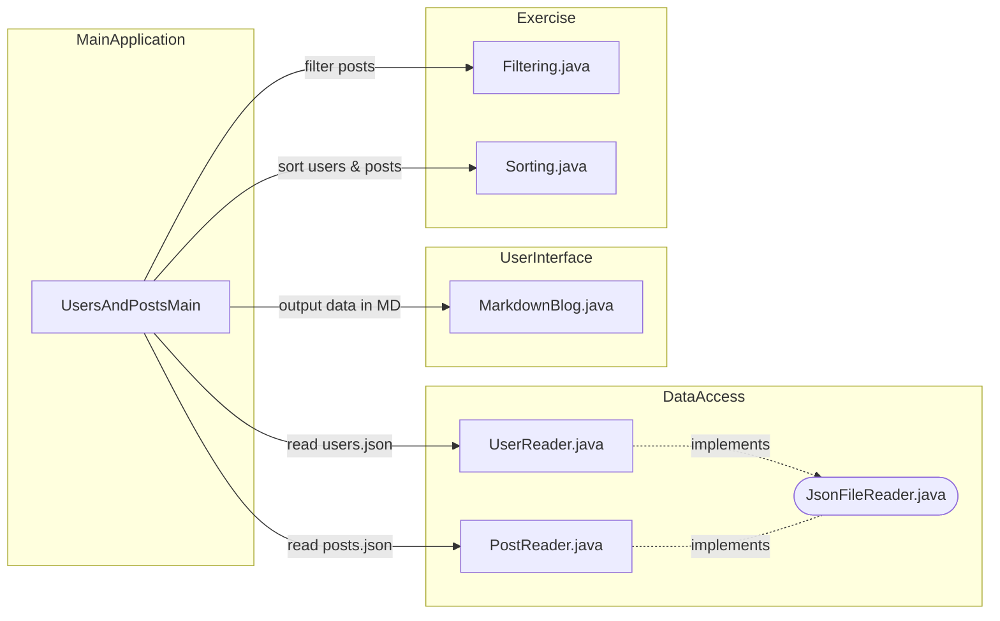
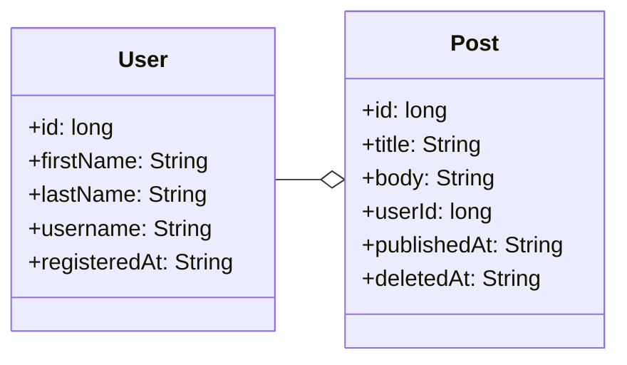

# Data structures and algorithms: filter and sort

In this task, we will explore filtering and sorting lists of Java objects based on different attributes.

Our goal is to learn certain pre-selected algorithms and data structures and to make our code testable and reusable.

## Checking the exercises

The tasks are automatically checked with [JUnit unit tests](./src/test/java/). Familiarizing yourself with the tests is not necessary to complete the task, but the tests can help you understand how your code should work.

💡 *You may write additional tests if you wish, but do not modify or delete the pre-written tests.*

💡 *Changing the names, parameters, or return types of the methods and classes specified in the task description is not allowed to ensure the tests work correctly.*

## Installing dependencies

This project template uses Google's [Gson library](https://github.com/google/gson/) for handling JSON files. The file handling is already implemented, so you do not need to familiarize yourself with the Gson library. Additionally, the project template uses the [JUnit testing tool](https://junit.org/) for running unit tests, as in previous tasks. These dependencies are pre-defined in the [build.gradle](./build.gradle) file.

Your code editor will likely install the project dependencies automatically when you open the project for the first time. You can also install the dependencies manually with the command:

```sh
./gradlew install       # Unix
.\gradlew.bat install   # Windows
```

## Running the main program

The task template includes a pre-implemented main program [UsersAndPostsMain.java](./src/main/java/app/UsersAndPostsMain.java) that prints users and posts. Initially, the outputs are incorrect, and for example, the same titles are printed for each user. However, the outputs will become correct as you solve the parts of the task.

You can run the [main program](./src/main/java/app/UsersAndPostsMain.java) either using the run button in your code editor or with Gradle:

```sh
./gradlew run       # Unix
.\gradlew.bat run   # Windows
```

The output of the provided main program is, for example, as follows:

```
# Isac Isodate (2022-07-16T22:57:59.361Z)
- TypeScript for dummies
  2023-06-30T05:30:54.612Z
- This post was published in 2021 and deleted in 2023
  2021-07-11T05:33:06.104Z 2023-07-21T23:53:01.586Z

# Ursula Unixdate (1638589047)
- There are different types of secrets.
  2023-09-01T10:02:19.997Z
- This was published in 2023 and has not been deleted
  2023-07-13T09:33:37.100Z
```

The output for each user is therefore as follows:

```
# [First name] [Last name] ([time of registration])
- [Post 1 title]
  [publishedAt timestamp] [deletedAt timestamp, if deleted]
- [Post 2 title]
  [publishedAt timestamp]
```

💡 *You do not need to change the main program to solve this task. However, modifying the main program to investigate its behavior is allowed 👍.*

## Program structure

The program is divided into several separate classes and methods to allow for unit testing of different functions and to enable their use in various parts of a larger application.

In this exercise, you only need to modify two classes: [Filtering.java](./src/main/java/exercise/Filtering.java) and [Sorting.java](./src/main/java/exercise/Sorting.java):



## Exercise data

The task uses example data in JSON format from the [dummyjson.com](https://dummyjson.com) service. The files [users.json](./data/users.json) and [posts.json](./data/posts.json) in the task template have been downloaded into this git repository from the [DummyJSON project's GitHub repository](https://github.com/Ovi/DummyJSON/blob/master/src/data/).

Compared to the original data, new attributes `publishedAt` and `deletedAt` have been added to the `Post` data type for this task:

```diff
 {
   "id": 5,
   "title": "Hopes and dreams were dashed that day.",
   "body": "Hopes and dreams were...",
   "userId": 41,
   "reactions": 2,
+  "publishedAt": "2023-06-01T08:07:20.410Z",
+  "deletedAt": "2023-06-14T02:16:08.513Z"
 }
```

The `User` data type has also been updated with the `registeredAt` information.

```diff
 {
   "id": 1,
   "firstName": "Terry",
   "lastName": "Medhurst",
   "username": "terrmed",
+  "registeredAt": "2022-07-16T22:57:59.361Z"
 }
```

The `publishedAt`, `deletedAt`, and `registeredAt` information will play a big role in the task.

The [`Post`](./src/main/java/model/Post.java) and [`User`](./src/main/java/model/Post.java) classes corresponding to these JSON data types can be found in the [model package](./src/main/java/model/). The classes are implemented as `Record` types because they are only intended to store information. You can read more about `Record` types in the [dev.java tutorial](https://dev.java/learn/records/).

The handling of the JSON file has already been implemented in the [`PostReader`](./src/main/java/json/PostReader.java) and  [`UserReader`](./src/main/java/json/UserReader.java) classes. **You do not need to handle the files yourself or create new `Post` or `User` objects.**

💡 *To read the JSON file in a Java program, we use the Gson library published by Google in this task. Gson allows converting JSON data to Java objects and vice versa. You do not need to delve into the details of Gson or use it yourself.*

## Task

Your company's product owner, Maxwell Goldgrabber, has written you the following fictional cover letter.

[TL;DR](https://en.wikipedia.org/wiki/TL;DR)🥱: If you don't feel like reading the story, you can skip directly to the task sections.

> Subject: RE: RE: RE: RE: Users and posts<br />
> From: Maxwell Goldgrabber &lt;maxmoney@example.com&gt;
>
> Dear developer,
>
> I hope this message finds you well. We have some critical tasks ahead that require your immediate attention. These tasks are not only essential for our product's success but also for my quarterly bonus, which is directly tied to their successful completion.
>
> * Task 1: *filterOutDeletedPosts*
>
>   Your first task is to implement the [*filterOutDeletedPosts* method](./src/main/java/exercise/Filtering.java). We've received complaints from our customers about deleted posts appearing in the listings. When the users delete their posts, we don't actually remove them, but we do a [soft delete and just mark the data as deleted](https://www.google.com/search?q=soft+delete). It's absolutely crucial that posts with a *deletedAt* timestamp are filtered out without fail.
>
> * Task 2: *filterPostsByUser*
>
>   Your second task involves implementing a [*filterPostsByUser* method](./src/main/java/exercise/Filtering.java). This method will ensure that we only show the given user's posts and do not mix posts from different users by mistake. Having this functionality in a separate method helps our testers conduct unit tests and other teams to reuse the code.
>
> * Task 3: *sortPostsByPublishedDate*
>
>   Task three is to implement a [*sortPostsByPublishedDate* method](./src/main/java/exercise/Sorting.java). We need this function to sort posts by *publishedAt* by implementing [a sorting algorithm](https://en.wikipedia.org/wiki/Sorting_algorithm) ourselves. [There are many to choose from and some seem more complex than others](https://youtu.be/RfXt_qHDEPw).
>
> * Task 4: *sortUsersByRegistrationDate*
>
>   Finally, we need to implement a [*sortUsersByRegistrationDate* method](./src/main/java/exercise/Sorting.java) in the same class. This method should sort users by their *registeredAt* date, accommodating different types of timestamps. **We appear to have a bit of technical debt in this field, as different users have their timestamps in different formats. We'll get into that a bit later.**.
>
> The urgency of these tasks cannot be overstated.
>
> On a lighter note, I wanted to share some exciting news. I've already made **a pre-order on a Tesla** 🚗, and my bonus 💰 from this quarter is playing a significant role in making that dream a reality. So, you can understand the importance of these tasks!!!1!
>
> Your job and my quarterly bonus are at stake if we don't address these issues promptly and effectively. I have complete confidence in your abilities, and I know you can rise to this challenge. Please prioritize these tasks and reach out if you need any guidance or assistance along the way.
>
> Thank you for your dedication to our project, and I look forward to seeing these improvements implemented!
>
> Best regards,
>
> Maxwell Goldgrabber<br/>
> Product Manager<br/>
> Programming 2 inc.<br/>
> *This email was written by ChatGPT*

## Part 1: `filterOutDeletedPosts` *(basics, 10%)*

Implement the method `filterOutDeletedPosts`, which can be found in the [`Filtering`](./src/main/java/exercise/Filtering.java) class. The method should return a new list that **excludes** all [`Post`](./src/main/java/model/Post.java) objects that have a `deletedAt` value set.

A ready-made `FilteringDeletedPostsTest` test class has been written for your solution, which you can run using your code editor's testing tool ([VS Code](https://code.visualstudio.com/docs/java/java-testing), [Eclipse](https://www.vogella.com/tutorials/JUnitEclipse/article.html)) or the [Gradle automation tool](https://docs.gradle.org/current/userguide/java_testing.html):

```
./gradlew test --tests FilteringDeletedPostsTest      # unix
.\gradlew.bat test --tests FilteringDeletedPostsTest  # Windows
```

💡 *It is recommended to use Stream objects to solve the task.*

## Part 2: `filterPostsByUser` *(basics, 20%)*

In the same [`Filtering`](./src/main/java/exercise/Filtering.java) class, there is a template for the `filterPostsByUser` method. This method takes as parameters a [`User`](./src/main/java/model/User.java) object and a list of [`Post`](./src/main/java/model/Post.java) objects. Your task is to further develop this method so that it returns a list containing only the `Post` objects of the given user. `User` objects are linked to `Post` objects by their id: each `Post` object has a `userId` that corresponds to the `id` of a `User` object:



A ready-made [`FilteringDeletedPostsTest`](./src/test/java/exercise/FilteringPostsByUserTest.java) test class has been written for your solution, which you can run using your code editor's testing tool ([VS Code](https://code.visualstudio.com/docs/java/java-testing), [Eclipse](https://www.vogella.com/tutorials/JUnitEclipse/article.html)) or the [Gradle automation tool](https://docs.gradle.org/current/userguide/java_testing.html):

```
./gradlew test --tests FilteringPostsByUserTest      # unix
.\gradlew.bat test --tests FilteringPostsByUserTest  # Windows
```

## Part 3: `sortPostsByPublishedDate` *(applying, 40%)*

In the third part of the task, you need to **arrange** or **sort** [`Post`](./src/main/java/model/Post.java) objects by their `publishedAt` publication time using a **sorting algorithm you implement yourself**.

In the [`Sorting`](./src/main/java/exercise/Sorting.java) class, a template for the following method is defined:

```java
public static List<Post> sortPostsByPublishedDate(List<Post> posts) {
    return posts; // TODO: Implement sorting logic
}
```

Implement your sorting logic in this method so that the method returns a new list sorted by the `publishedAt` publication time of the `Post` objects in ascending order. You can also implement separate helper methods that you call from this method if you wish. You may also add new methods to the `Post` class if needed.

Note that your code should sort **entire `Post` objects**, meaning you cannot extract only titles and publication times from the data. You also must not modify the given list or the objects in it.

💡 *The `publishedAt` publication times are all strings presented in [ISO 8601](https://en.wikipedia.org/wiki/ISO_8601) format, e.g., `"2023-06-01T08:07:20.410Z"`. You can use "alphabetical order" for comparing these times.*

A ready-made [`SortingPostsTest`](./src/test/java/exercise/SortingPostsTest.java) test class has been written for your solution, which you can run as usual using your code editor's testing tool or Gradle:

```
./gradlew test --tests SortingPostsTest      # unix
.\gradlew.bat test --tests SortingPostsTest  # Windows
```


📣 **The goal of this exercise is to learn how to implement a well-known sorting algorithm yourself, so using Java's built-in sort implementations is not allowed.**

### Common Sorting Algorithms

Before starting the task, it is important to have a basic understanding of what sorting data programmatically is all about. Sorting algorithms are essentially language-independent in terms of their logic. The video Sorting Algorithms Explained Visually (Beyond Fireship) is a good 9-minute introduction to the topic if, for example, choosing an algorithm is challenging.

We have compiled some good options below, which also have good video tutorials in Java. You can find many other good resources by searching for the algorithm names:

**Quicksort**

[https://en.wikipedia.org/wiki/Quicksort](https://en.wikipedia.org/wiki/Quicksort)

[YouTube: Quicksort Sort Algorithm in Java - Full Tutorial With Source (Coding with John)](https://www.youtube.com/watch?v=h8eyY7dIiN4)

**Merge Sort**

[https://en.wikipedia.org/wiki/Merge_sort](https://en.wikipedia.org/wiki/Merge_sort)

[YouTube: Merge Sort Algorithm in Java - Full Tutorial with Source (Coding with John)](https://www.youtube.com/watch?v=bOk35XmHPKs)

**Insertion Sort**

[https://en.wikipedia.org/wiki/Insertion_sort](https://en.wikipedia.org/wiki/Insertion_sort)

[YouTube: Insertion Sort Algorithm in Java - Full Tutorial With Source](https://www.youtube.com/watch?v=0lOnnd50cGI)

**Bubble Sort**

[https://en.wikipedia.org/wiki/Bubble_sort](https://en.wikipedia.org/wiki/Bubble_sort)

[YouTube: Bubble Sort Algorithm Tutorial in Java - How Fast Is It? (Coding with John)](https://www.youtube.com/watch?v=g8qeaEd2jTc)

### Criteria for choosing an algorithm

You can choose an algorithm that you like by first exploring their efficiency. You can also choose one that seems simple to implement. Remember, you can ask for advice on any challenge you encounter in the task. Many other course participants are likely facing the same challenges.

🚀 *If you want to maximize new learning, choose to implement a **recursive** algorithm like **Quicksort** or **Merge Sort**. A recursive algorithm solves the problem by dividing it into smaller subproblems and using the same algorithm to solve these subproblems.*

💡 *In a real software project, you would use Java's built-in sorting logic with either the [Comparator](https://docs.oracle.com/en/java/javase/21/docs/api/java.base/java/util/Comparator.html) or [Comparable](https://docs.oracle.com/en/java/javase/21/docs/api/java.base/java/lang/Comparable.html) interface. However, in this task, we practice implementing the algorithm ourselves, so we will write the sorting logic. In the next part of the task, you will be allowed to use a built-in method.*

## Part 4: `sortUsersByRegistrationDate` *(applying, 30%)*

The final part of the task is another sorting task, where the varying data types of the sortable material require some adaptation. For this task, the fictional product owner Maxwell Goldgrabber has written another cover letter:

> Subject: RE: RE: RE: RE: RE: Users and posts<br />
> From: Maxwell Goldgrabber &lt;maxmoney@example.com&gt;
>
> As part of our ongoing improvements to our platform, we've encountered a unique challenge with the `registeredAt` attribute in our user records. The `registeredAt` attribute stores the registration date for each user. However, we've noticed that different users have different data types for this attribute. **Users who registered through our mobile app have [a numeric value representing the epoch timestamp (in seconds)](https://en.wikipedia.org/wiki/Unix_time)**, while **users who registered through the web app have [a date string in ISO format](https://en.wikipedia.org/wiki/ISO_8601)**. It's crucial that we sort all users in ascending order by their registration date, regardless of the data type inconsistency.
>
> I am sure that you will find existing Java classes and methods in the standard library for converting and comparing the timestamps. In this case, you are allowed to utilize the pre-existing `sort` methods. However, I encourage you to reuse the sorting logic that you previously used when sorting posts.
>
> Thank you for your dedication to our project, and I look forward to seeing your solution in action.
>
> Maxwell Goldgrabber<br/>
> Product Manager<br/>
> Ohjelmointi 2 inc.<br/>
> *This email was written by ChatGPT*
>
>
> P.S. Here are examples of the different types of `registeredAt` values for users:
>
> 1. **Epoch Timestamp**:
>    - User 1: Registered at "1632218400" (Represents September 21, 2021, at 12:00:00 UTC)
>    - User 2: Registered at "1663754400" (Represents February 19, 2023, at 12:00:00 UTC)
>
> 2. **ISO Format**:
>    - User 3: Registered at "2022-08-15T18:30:00Z" (Represents August 15, 2022, at 18:30:00 UTC)
>    - User 4: Registered at "2023-04-10T09:45:00Z" (Represents April 10, 2023, at 09:45:00 UTC)
>
> These examples demonstrate the variation in the `registeredAt` attribute's data types, with some users having [epoch timestamps](https://en.wikipedia.org/wiki/Unix_time) and others having [ISO 8601 formatted dates](https://en.wikipedia.org/wiki/ISO_8601). It's essential that your implementation handles the different types of dates for the *registeredAt* attribute.

When comparing users, you need to consider that their registration time may be presented in two different string formats. It might be useful to implement a separate helper method that returns the registration time in the same format regardless of the user. A convenient format might be Java's [`Instant`](https://docs.oracle.com/en/java/javase/17/docs/api/java.base/java/time/Instant.html) class. You can implement helper methods in both the [`User`](./src/main/java/model/User.java) class and the [`Sorting`](./src/main/java/exercise/Sorting.java) class at your discretion. Additionally, you might benefit from the chapter [The Date Time API](https://dev.java/learn/date-time/) in the Java tutorial.

A ready-made [`SortingUsersTest`](./src/test/java/exercise/SortingUsersTest.java) test class has been written for your solution, which you can run as usual using your code editor's testing tool or Gradle:

```
./gradlew test --tests SortingUsersTest      # unix
.\gradlew.bat test --tests SortingUsersTest  # Windows
```

## 🚀 Pro task: generic sorting method

Although you can use a built-in sort method in the final part of the task, further developing the sorting algorithm you implemented in the previous part into a ["generic"](https://dev.java/learn/generics/intro/) one can be an educational experience. You can find more information about generic types, for example, in the [dev.java tutorial](https://dev.java/learn/generics/intro/) or numerous online sources.

[YouTube: Generics In Java - Full Simple Tutorial (Coding with John)](https://www.youtube.com/watch?v=K1iu1kXkVoA)

## 🚀 Pro task: sorting with streams

There are numerous ways to sort data. Challenge yourself and implement the sorting in the final part of the task using the [Java Stream API](https://dev.java/learn/api/streams/intermediate-operation/).

[What is Stream.sorted() method in Java? (educative)](https://www.educative.io/answers/what-is-streamsorted-method-in-java)

## License and authors

This exercise is made by Teemu Havulinna and translated to English by Kalle Ilves and it is licensed under a [Creative Commons BY-NC-SA license](https://creativecommons.org/licenses/by-nc-sa/4.0/).

ChatGPT 3.5 language model and GitHub copilot AI assistant has been used to implement the exercise.

## DummyJSON

The [DummyJSON](https://github.com/Ovi/DummyJSON/) service used in the task was developed by [Muhammad Ovi (Owais)](https://github.com/Ovi/) and is licensed under the MIT license: [https://github.com/Ovi/DummyJSON/blob/master/LICENCE](https://github.com/Ovi/DummyJSON/blob/master/LICENCE).

## Gson

The [Gson](https://github.com/google/gson) library developed by Google, used for handling JSON files, is licensed under the [Apache License](https://github.com/google/gson/blob/main/LICENSE).
