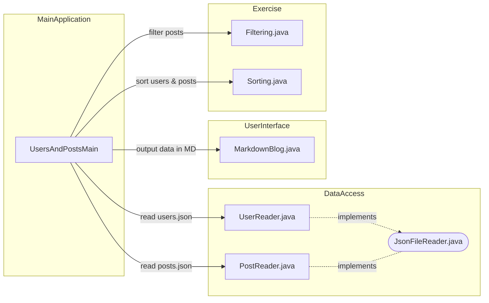
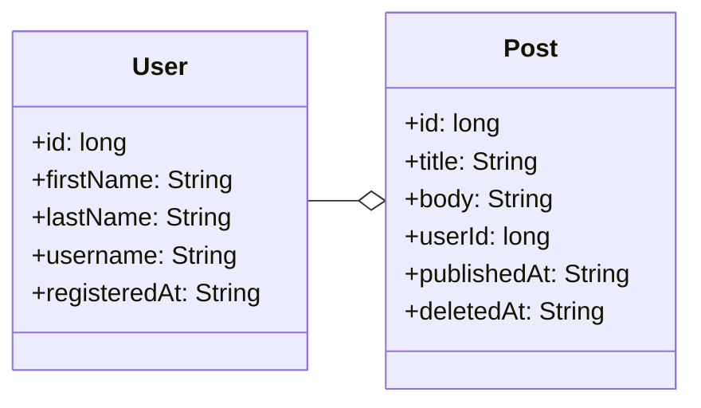

# Tietorakenteet ja algoritmit: filter ja sort

Tässä tehtävässä perehdytään Java-olioista koostuvien listojen suodattamiseen ja lajitteluun eri attribuuttien perusteella.

Tavoitteenamme on opetella tiettyjä ennalta valittuja algoritmeja sekä tietorakenteita sekä tehdä koodistamme testattavaa ja uudelleenkäytettävää.


## Tehtävien tarkastaminen

Tehtävät tarkastetaan automaattisesti [JUnit-yksikkötesteillä](./src/test/java/). Testeihin perehtyminen ei ole tehtävän suorittamiseksi välttämätöntä, mutta testit voivat auttaa hahmottamaan miten oman koodisi tulee toimia.

💡 *Saat kirjoittaa halutessasi lisää testejä, mutta älä muuta tai poista valmiiksi kirjoitettuja testejä.*

💡 *Tehtävänannossa määritettyjen metodien ja luokkien nimien, parametrien tai paluuarvojen muuttaminen ei ole sallittua testien toimivuuden varmistamiseksi.*


## Riippuvuuksien asentaminen

Tämä projektipohja hyödyntää Googlen julkaisemaa [Gson-kirjastoa](https://github.com/google/gson/) JSON-muotoisten tiedostojen käsittelemiseksi. Tiedostojen käsittely on toteutettu valmiina, joten sinun ei itse tarvitse perehtyä Gson-kirjastoon. Lisäksi projektipohjassa hyödynnetään aikaisempien tehtävien tavoin [JUnit-testaustyökalua](https://junit.org/) yksikkötestien suorittamiseksi. Nämä riippuvuudet on määritetty valmiiksi [build.gradle](./build.gradle)-tiedostoon.

Koodieditorisi asentaa todennäköisesti projektin riippuvuudet automaattisesti, kun avaat projektin ensimmäistä kertaa. Voit asentaa riippuvuudet myös manuaalisesti komennolla:

```sh
./gradlew install       # Unix
.\gradlew.bat install   # Windows
```

## Pääohjelman suorittaminen

Tehtäväpohjassa on valmiiksi toteutettu pääohjelma [UsersAndPostsMain.java](./src/main/java/app/UsersAndPostsMain.java), joka tulostaa käyttäjiä ja postauksia. Tulosteet ovat alussa virheelliset, ja esimerkiksi jokaisen käyttäjän kohdalla tulostuu samat otsikot. Tulosteet muuttuvat kuitenkin oikeiksi sitä mukaa, kun ratkot tehtävän osia.

Voit suorittaa [pääohjelman](./src/main/java/app/UsersAndPostsMain.java) joko koodieditorisi run-painikkeella tai Gradle:n avulla:

```sh
./gradlew run       # Unix
.\gradlew.bat run   # Windows
```

Annetun pääohjelman tuloste on muodoltaan esim. seuraava:

```
# Samantha Stringdate (2022-07-16T22:57:59.361Z)
 - TypeScript for dummies
   2023-06-30T05:30:54.612Z 2023-07-13T14:36:48.159Z
 - This post was published in 2021 and deleted in 2023
   2021-07-11T05:33:06.104Z 2023-07-21T23:53:01.586Z

# Nelson Numericdate (1638589047)
 - There are different types of secrets.
   2023-09-01T10:02:19.997Z
 - This was published in 2023 and has not been deleted
   2023-07-13T09:33:37.100Z
```

Jokaisen käyttäjän tuloste on siis muodoltaan seuraava:

```
# [Etunimi] [Sukunimi] ([rekisteröitymisaika])
 - [Postaus 1:n otsikko]
   [postedAt-aikaleima] [deletedAt-aikaleima, jos poistettu]
 - [Postaus 2:n otsikko]
   [postedAt-aikaleima]
```

💡 *Sinun ei tarvitse muuttaa pääohjelmaa ratkaistessasi tätä tehtävää. Pääohjelman muuttaminen esim. ohjelman toiminnan tutkimiseksi on kuitenkin halutessasi sallittua 👍.*


## Ohjelman rakenne

Ohjelma on pilkottu useisiin erillisiin luokkiin ja metodeihin, jotta eri toiminnot saadaan yksikkötestattua ja jotta niitä voidaan hyödyntää eri puolilla isompaa sovelluskokonaisuutta.

Sinun tarvitsee tässä harjoituksessa muokata ainoastaan kahta luokkaa: [Filtering.java](./src/main/java/exercise/Filtering.java) ja [Sorting.java](./src/main/java/exercise/Sorting.java):




## Tehtävän data

Tehtävässä hyödynnetään JSON-muotoista esimerkkidataa [dummyjson.com](https://dummyjson.com)-palvelusta. Tehtäväpohjan tiedostot [users.json](./data/users.json) sekä [posts.json](./data/posts.json) on ladattu tähän git-repositorioon [DummyJSON-projektin GitHub-repositoriosta](https://github.com/Ovi/DummyJSON/blob/master/src/data/).

Alkuperäiseen dataan nähden tätä tehtävää varten `Post`-tietotyyppiin on tehty uudet attribuutit `publishedAt` sekä `deletedAt`:

```diff
 {
   "id": 5,
   "title": "Hopes and dreams were dashed that day.",
   "body": "Hopes and dreams were...",
   "userId": 41,
   "reactions": 2,
+  "publishedAt": "2023-06-01T08:07:20.410Z",
+  "deletedAt": "2023-06-14T02:16:08.513Z"
 }
```

`User`-tietotyyppiin on lisäksi lisätty `registeredAt`-tieto.

```diff
 {
   "id": 1,
   "firstName": "Terry",
   "lastName": "Medhurst",
   "username": "terrmed",
+  "registeredAt": "2022-07-16T22:57:59.361Z"
 }
```

Näitä JSON-tietotyyppejä vastaavat `Post`- ja `User`-luokat löytyvät valmiina [model-paketista](./src/main/java/model/).

Luokat on toteutettu `Record`-tyyppisinä, koska niiden on tarkoitus ainoastaan varastoida tietoa. Voit lukea halutessasi lisää `Record`-tyypeistä [dev.java-tutoriaalista](https://dev.java/learn/records/):

```java
// User-olioita käytetään aivan kuten mitä tahansa "tavallisten" luokkien olioita:
User user = new User(1, "John", "Doe", "johndoe", "2023-09-29");

// Luokalta löytyy automaattisesti "getterit" kaikille kentille:
System.out.println("User id: " + user.id());
System.out.println("First name: " + user.firstName());
System.out.println("Last name: " + user.lastName());
System.out.println("Username: " + user.username());
System.out.println("Registered at: " + user.registeredAt());

// Record-olioiolla on "gettereiden" lisäksi kokoelma muita valmiita
// metodeja, kuten toString(), equals() and hashCode(
System.out.println("User object: " + user);
```

💡 *JSON-tiedoston lukemiseen Java-ohjelmassa käytämme tässä tehtävässä Googlen julkaisemaa [Gson-kirjastoa](https://github.com/google/gson). Gson mahdollistaa JSON-datan muuntamisen Java-olioiksi ja päinvastoin. JSON-tiedoston käsittely on toteutettu valmiiksi [PostReader](./src/main/java/json/PostReader.java)- ja [UserReader](./src/main/java/json/UserReader.java)-luokissa. Sinun ei tarvitse perehtyä Gson:in yksityiskohtiin tai käyttää sitä itse.*


## Tehtävä

Yrityksenne tuoteomistaja Maxwell Goldgrabber on kirjoittanut sinulle oheisen fiktiivisen saateviestin.

[TL;DR](https://en.wikipedia.org/wiki/TL;DR)🥱: Jos et jaksa lukea tarinaa, voit hypätä viestin yli suoraan tehtävän osiin.

> Subject: RE: RE: RE: RE: Users and posts<br />
> From: Maxwell Goldgrabber &lt;maxmoney@example.com&gt;
>
> Dear developer,
>
> I hope this message finds you well. We have some critical tasks ahead that require your immediate attention. These tasks are not only essential for our product's success but also for my quarterly bonus, which is directly tied to their successful completion.
>
> * Task 1: *filterOutDeletedPosts*
>
>   Your first task is to implement the [*filterOutDeletedPosts* method](./src/main/java/exercise/Filtering.java). We've received complaints from our customers about deleted posts appearing in the listings. When the users delete their posts, we don't actually remove them, but we do a [soft delete and just mark the data as deleted](https://www.google.com/search?q=soft+delete). It's absolutely crucial that posts with a *deletedAt* timestamp are filtered out without fail.
>
> * Task 2: *filterPostsByUser*
>
>   Your second task involves implementing a [*filterPostsByUser* method](./src/main/java/exercise/Filtering.java). This method will ensure that we only show the given user's posts and do not mix posts from different users by mistake. Having this functionality in a separate method helps our testers conduct unit tests and other teams to reuse the code.
>
> * Task 3: *sortPostsByPublishedDate*
>
>   Task three is to implement a [*sortPostsByPublishedDate* method](./src/main/java/exercise/Sorting.java). We need this function to sort posts by *publishedAt* by implementing [a sorting algorithm](https://en.wikipedia.org/wiki/Sorting_algorithm) ourselves. [There are many to choose from and some seem more complex than others](https://youtu.be/RfXt_qHDEPw).
>
> * Task 4: *sortUsersByRegistrationDate*
>
>   Finally, we need to implement a [*sortUsersByRegistrationDate* method](./src/main/java/exercise/Sorting.java) in the same class. This method should sort users by their *registeredAt* date, accommodating different types of timestamps. **We appear to have a bit of technical debt in this field, as different users have their timestamps in different formats. We'll get into that a bit later.**.
>
> The urgency of these tasks cannot be overstated.
>
> On a lighter note, I wanted to share some exciting news. I've already made **a pre-order on a Tesla** 🚗, and my bonus 💰 from this quarter is playing a significant role in making that dream a reality. So, you can understand the importance of these tasks!!!1!
>
> Your job and my quarterly bonus are at stake if we don't address these issues promptly and effectively. I have complete confidence in your abilities, and I know you can rise to this challenge. Please prioritize these tasks and reach out if you need any guidance or assistance along the way.
>
> Thank you for your dedication to our project, and I look forward to seeing these improvements implemented!
>
> Best regards,
>
> Maxwell Goldgrabber<br/>
> Product Manager<br/>
> Ohjelmointi 2 inc.<br/>
> *This email was written by ChatGPT*


## Osa 1: `filterOutDeletedPosts` *(perusteet, 10 %)*

Toteuta metodi `filterOutDeletedPosts`, jonka pohja löytyy [`Filtering`-luokasta](./src/main/java/exercise/Filtering.java). Metodin tulee palauttaa uusi lista, josta **puuttuu** kaikki sellaiset `Post`-oliot, joilla on asetettuna `deletedAt`-arvo.

Ratkaisullesi on kirjoitettu valmis [`FilteringDeletedPostsTest`-testiluokka](./src/test/java/exercise/FilteringDeletedPostsTest.java), jonka voit suorittaa koodieditorisi testaustyökalulla ([VS Code](https://code.visualstudio.com/docs/java/java-testing), [Eclipse](https://www.vogella.com/tutorials/JUnitEclipse/article.html)) tai [Gradle-automaatiotyökalulla](https://docs.gradle.org/current/userguide/java_testing.html):

```
./gradlew test --tests FilteringDeletedPostsTest      # unix
.\gradlew.bat test --tests FilteringDeletedPostsTest  # Windows
```

💡 *Tehtävän ratkaisemisessa kannattaa hyödyntää Stream-olioita.*


## Osa 2: `filterPostsByUser` *(perusteet, 20 %)*

Samassa [`Filtering`-luokassa](./src/main/java/exercise/Filtering.java) on pohja `filterPostsByUser`-metodille. Tämä metodi saa parametreinaan yhden `User`-olion sekä listan `Post`-olioista. Tehtävänäsi on jatkokehittää tätä metodia siten, että se palauttaa listan, jossa on ainoastaan annetun käyttäjän `Post`-oliot. `User`-oliot yhdistetään `Post`-olioihin niiden id:n perusteella: jokaisella `Post`-oliolla on `userId`, joka vastaa yhden `User`-olion `id`:tä:



Ratkaisullesi on kirjoitettu valmiit testit [`FilteringPostsByUserTest`-testiluokkaan](./src/test/java/exercise/FilteringPostsByUserTest.java). Voit suorittaa ne koodieditorisi testaustyökalulla ([VS Code](https://code.visualstudio.com/docs/java/java-testing), [Eclipse](https://www.vogella.com/tutorials/JUnitEclipse/article.html)) tai [Gradle-automaatiotyökalulla](https://docs.gradle.org/current/userguide/java_testing.html):

```
./gradlew test --tests FilteringPostsByUserTest      # unix
.\gradlew.bat test --tests FilteringPostsByUserTest  # Windows
```


## Osa 3: `sortPostsByPublishedDate` *(soveltaminen, 40 %)*

Tehtävän kolmannessa osassa sinun tulee **järjestää** eli **lajitella** `Post`-olioita niiden julkaisuajan mukaan käyttäen **itse toteuttamaasi lajittelualgoritmia**.

[`Sorting`-luokassa](./src/main/java/exercise/Sorting.java) on määriteltynä pohja seuraavalle metodille:

```java
public static List<Post> sortPostsByPublishedDate(List<Post> posts) {
    return posts; // TODO: Implement sorting logic
}
```

Toteuta lajittelulogiikkasi tähän metodiin siten, että metodi palauttaa uuden listan, joka on lajiteltu Post-olioiden julkaisuajan mukaan kasvavassa järjestyksessä. Voit halutessasi toteuttaa myös erillisiä apumetodeita, joita kutsut tästä metodista. Saat myös halutessasi lisätä uusia metodeja `Post`-luokkaan.

Huomaa, että koodisi tulee lajitella **kokonaisia `Post`-olioita**, eli et voi poimia aineistosta esimerkiksi pelkkiä otsikoita ja julkaisuaikoja. Et saa myöskään muuttaa annettuja listaa tai sillä olevia olioita.

💡 *`publishedAt`-julkaisuajat ovat kaikki merkkijonoja, jotka on esitetty [ISO 8601](https://en.wikipedia.org/wiki/ISO_8601) -muodossa samassa aikavyöhykkeessä. [Näiden aikojen järjestämisessä voit siis hyödyntää merkkijonojen aakkosjärjestystä](https://stackoverflow.com/a/9576911).*

Ratkaisullesi on kirjoitettu valmis [`SortingPostsTest`-testiluokka](./src/test/java/exercise/SortingPostsTest.java), jonka voit suorittaa tuttuun tapaan koodieditorisi testaustyökalulla tai Gradlen avulla:

```
./gradlew test --tests SortingPostsTest      # unix
.\gradlew.bat test --tests SortingPostsTest  # Windows
```

<center>🚨 🚨 🚨 🚨 🚨 🚨 🚨 🚨 🚨</center>

<center><em><strong>Tämän harjoituksen tavoitteena on opetella itse toteuttamaan jokin tunnettu lajittelualgoritmi, joten Javan valmiiden sort-toteutusten käyttämistä ei sallita.</strong></em></center>

<center>🚨 🚨 🚨 🚨 🚨 🚨 🚨 🚨 🚨</center>


### Yleisimmät lajittelualgoritmit

Ennen tehtävään ryhtymistä sinulla on tärkeää olla alustava käsitys siitä, mistä tiedon ohjelmallisessa lajittelussa ylipäänsä on kyse. Lajittelualgoritmit ovat logiikkansa puolesta käytännössä ohjelmointikielistä riippumattomia. Video [Sorting Algorithms Explained Visually (Beyond Fireship)](https://youtu.be/RfXt_qHDEPw) on hyvä 9 minuutin intro aiheeseen, mikäli esimerkiksi algoritmin valinta tuottaa haasteita.

Olemme koonneet alle hyviä vaihtoehtoja, joille löytyy myös hyvät videotutoriaalit Java-kielellä. Löydät algoritmien nimillä myös lukuisia muita hyviä lähteitä:


**Pikalajittelu eli Quicksort**

[https://en.wikipedia.org/wiki/Quicksort](https://en.wikipedia.org/wiki/Quicksort)

[YouTube: Quicksort Sort Algorithm in Java - Full Tutorial With Source (Coding with John)](https://www.youtube.com/watch?v=h8eyY7dIiN4)

**Lomituslajittelu eli Merge Sort**

[https://en.wikipedia.org/wiki/Merge_sort](https://en.wikipedia.org/wiki/Merge_sort)

[YouTube: Merge Sort Algorithm in Java - Full Tutorial with Source (Coding with John)](https://www.youtube.com/watch?v=bOk35XmHPKs)

**Lisäyslajittelu eli Insertion Sort**

[https://en.wikipedia.org/wiki/Insertion_sort](https://en.wikipedia.org/wiki/Insertion_sort)

[YouTube: Insertion Sort Algorithm in Java - Full Tutorial With Source](https://www.youtube.com/watch?v=0lOnnd50cGI)

**Kuplalajittelu eli Bubble Sort**

[https://en.wikipedia.org/wiki/Bubble_sort](https://en.wikipedia.org/wiki/Bubble_sort)

[YouTube: Bubble Sort Algorithm Tutorial in Java - How Fast Is It? (Coding with John)](https://www.youtube.com/watch?v=g8qeaEd2jTc)


### Algoritmin valintaperusteet

Voit valita itsellesi mieluisen algoritmin esimerkiksi tutustumalla ensin niiden tehokkuuteen. Voit myös hyvin valita sen, joka vaikuttaa toteutukseltaan sopivan yksinkertaiselta. Muista myös, että voit kysyä neuvoa mihin vain tehtävässä kohtaamaasi haasteeseen liittyen. Todennäköisesti samojen haasteiden parissa kamppailee myös moni muu kurssilainen.

🚀 *Jos haluat maksimoida uuden oppimisen, valitse toteutettavaksi **rekursiivinen** algoritmi kuten **Quicksort** tai **Merge Sort**. Rekursiivinen algoritmi ratkaisee ongelman jakamalla sen pienempiin osaongelmiin ja käyttämällä samaa algoritmia näiden osaongelmien ratkaisemiseen.*

💡 *Oikeassa ohjelmistoprojektissa käyttäisit Javan valmista lajittelulogiikkaa joko [Comparator](https://docs.oracle.com/en/java/javase/21/docs/api/java.base/java/util/Comparator.html)- tai [Comparable](https://docs.oracle.com/en/java/javase/21/docs/api/java.base/java/lang/Comparable.html)-rajapinnan avulla. Tässä tehtävässä harjoittelemme kuitenkin algoritmin toteutusta, joten kirjoitamme lajittelun itse. Tehtävän seuraavassa osassa saat käyttää valmista metodia.*


## Osa 4: `sortUsersByRegistrationDate` *(soveltaminen, 30 %)*

Tehtävän viimeinen osa on toinen lajittelutehtävä, jossa lajiteltavan aineiston vaihtelevat tietotyypit edellyttävät hieman soveltamista. Tähän tehtävään liittyen fiktiivinen tuoteomistaja Maxwell Goldgrabber on kirjoittanut toisen saateviestin:

> Subject: RE: RE: RE: RE: RE: Users and posts<br />
> From: Maxwell Goldgrabber &lt;maxmoney@example.com&gt;
>
> As part of our ongoing improvements to our platform, we've encountered a unique challenge with the `registeredAt` attribute in our user records. The `registeredAt` attribute stores the registration date for each user. However, we've noticed that different users have different data types for this attribute. **Users who registered through our mobile app have [a numeric value representing the epoch timestamp (in seconds)](https://en.wikipedia.org/wiki/Unix_time)**, while **users who registered through the web app have [a date string in ISO format](https://en.wikipedia.org/wiki/ISO_8601)**. It's crucial that we sort all users in ascending order by their registration date, regardless of the data type inconsistency.
>
> I am sure that you will find existing Java classes and methods in the standard library for converting and comparing the timestamps. In this case, you are allowed to utilize the pre-existing `sort` methods. However, I encourage you to reuse the sorting logic that you previously used when sorting posts.
>
> Thank you for your dedication to our project, and I look forward to seeing your solution in action.
>
> Maxwell Goldgrabber<br/>
> Product Manager<br/>
> Ohjelmointi 2 inc.<br/>
> *This email was written by ChatGPT*
>
>
> P.S. Here are examples of the different types of `registeredAt` values for users:
>
> 1. **Epoch Timestamp**:
>    - User 1: Registered at "1632218400" (Represents September 21, 2021, at 12:00:00 UTC)
>    - User 2: Registered at "1663754400" (Represents February 19, 2023, at 12:00:00 UTC)
>
> 2. **ISO Format**:
>    - User 3: Registered at "2022-08-15T18:30:00Z" (Represents August 15, 2022, at 18:30:00 UTC)
>    - User 4: Registered at "2023-04-10T09:45:00Z" (Represents April 10, 2023, at 09:45:00 UTC)
>
> These examples demonstrate the variation in the `registeredAt` attribute's data types, with some users having [epoch timestamps](https://en.wikipedia.org/wiki/Unix_time) and others having [ISO 8601 formatted dates](https://en.wikipedia.org/wiki/ISO_8601). It's essential that your implementation handles the different types of dates for the *registeredAt* attribute.


Käyttäjiä vertaillessasi siis sinun tulee siis huomioida, että niiden rekisteröitymisaika saattaa olla esitettynä merkkijonomuodossa kahdella eri tavalla. Tässä voi olla hyödyksi toteuttaa erillinen apumetodi, joka palauttaa käyttäjästä riippumatta rekisteröitymisajan aina samassa muodossa. [Kätevä muoto saattaa olla esimerkiksi Javan `Instant`-luokka](https://docs.oracle.com/en/java/javase/17/docs/api/java.base/java/time/Instant.html). Saat oman harkintasi mukaan toteuttaa apumetodeja sekä [`User`-luokkaan](./src/main/java/model/User.java) että [`Sorting`-luokkaan](./src/main/java/exercise/Sorting.java). Lisäksi saatat hyötyä Java-tutoriaalin [The Date Time API](https://dev.java/learn/date-time/)-luvusta.

Ratkaisullesi on kirjoitettu valmis [`SortingUsersTest`-testiluokka](./src/test/java/exercise/SortingUsersTest.java), jonka voit suorittaa tuttuun tapaan koodieditorisi testaustyökalulla tai Gradlen avulla:

```
./gradlew test --tests SortingUsersTest      # unix
.\gradlew.bat test --tests SortingUsersTest  # Windows
```


## 🚀 Pro task: Geneerinen lajittelumetodi

Vaikka saat käyttää tehtävän viimeisessä osassa valmista sort-metodia, edellisessä osassa toteuttamasi lajittelualgoritmin jatkokehittäminen ["geneeriseksi"](https://dev.java/learn/generics/intro/) voi olla opettavainen kokemus. Geneerisistä tyypeistä löydät lisätietoa esim. [dev.java-tutoriaalista](https://dev.java/learn/generics/intro/) tai lukuisista nettilähteistä.

[YouTube: Generics In Java - Full Simple Tutorial (Coding with John)](https://www.youtube.com/watch?v=K1iu1kXkVoA)


## 🚀 Pro task: Lajittelu streamien avulla

Tapoja aineiston lajittelemiseksi on lukuisia. Haasta itsesi ja toteuta tehtävän viimeisessä osassa lajittelu hyödyntäen [Javan Stream API:a](https://dev.java/learn/api/streams/intermediate-operation/).

[What is Stream.sorted() method in Java? (educative)](https://www.educative.io/answers/what-is-streamsorted-method-in-java)


## Lisenssi ja tekijät

Tämän tehtävän on kehittänyt Teemu Havulinna ja se on lisensoitu [Creative Commons BY-NC-SA -lisenssillä](https://creativecommons.org/licenses/by-nc-sa/4.0/).

Tehtävänannon, lähdekoodien ja testien toteutuksessa on hyödynnetty ChatGPT 3.5 -kielimallia sekä GitHub copilot -tekoälyavustinta.

## DummyJSON

Tehtävässä hyödynnetyn [DummyJSON](https://github.com/Ovi/DummyJSON/)-palvelun on kehittänyt [Muhammad Ovi (Owais)](https://github.com/Ovi/) ja se on lisensoitu MIT-lisenssillä: [https://github.com/Ovi/DummyJSON/blob/master/LICENCE](https://github.com/Ovi/DummyJSON/blob/master/LICENCE).

## Gson

JSON-tiedostojen käsittelyssä hyödynnetty Googlen kehittämä [Gson-kirjasto](https://github.com/google/gson) on lisensoitu [Apache-lisenssillä](https://github.com/google/gson/blob/main/LICENSE).
